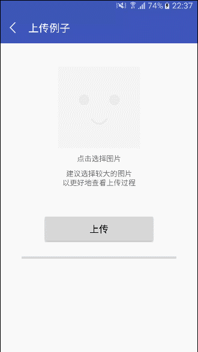
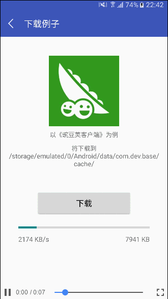
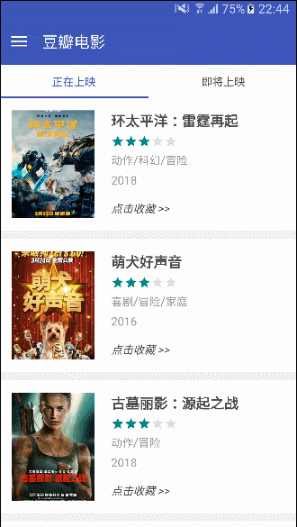
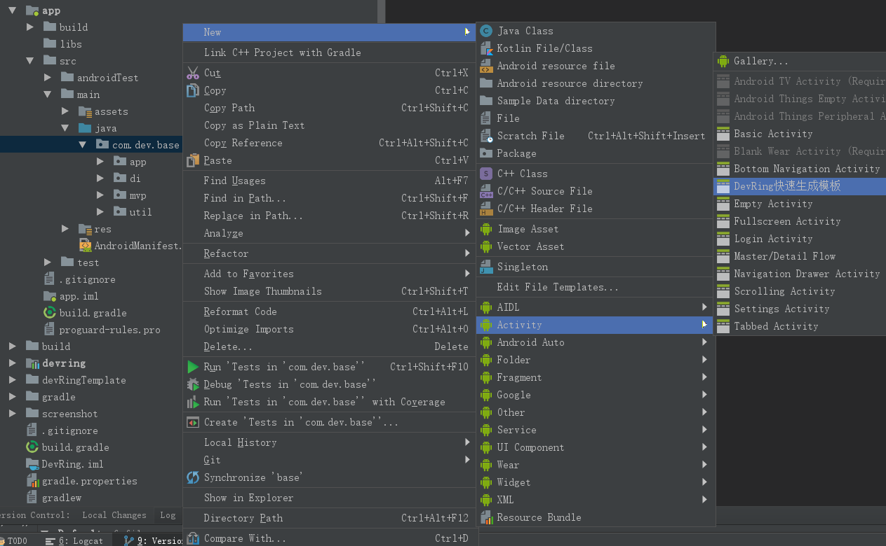
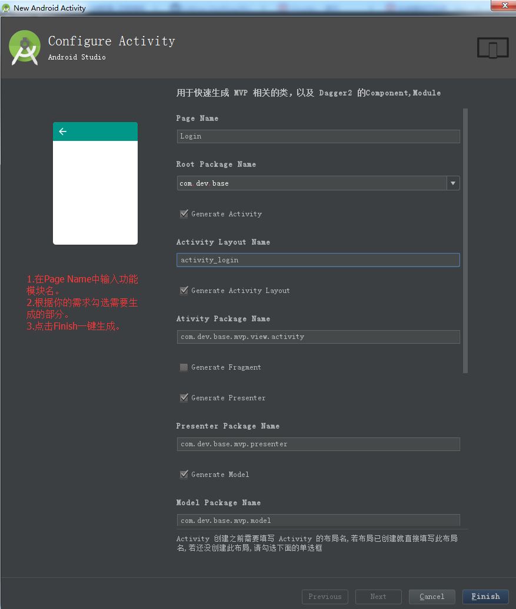

# DevRing  
[](https://github.com/LJYcoder/DevRing)
[](http://www.apache.org/licenses/LICENSE-2.0)
[](https://github.com/LJYcoder/DevRing)
[](https://www.jianshu.com/u/2ebe42698573)  

## 介绍
**DevRing**是一个提供了常用模块的**安卓基础开发库**。
<br>
主要包括 **网络请求**、**图片加载**、**数据库**、**事件总线**、**缓存**、**权限管理**、**工具类** 模块。

其中，网络请求使用Retrofit+RxJava实现，图片加载使用Glide实现（可替换），数据库使用GreenDao实现（可替换），事件总线使用EventBus实现（可替换），权限管理使用RxPermission实现。

Demo采用**MVP**+**Dagger2**进行开发，对以上提及的框架不熟悉的建议先行了解，底部也有相关的**博客链接**。

## 使用
### [详细使用说明请点这里](https://www.jianshu.com/p/abede6623c58)
### 1.添加依赖
在项目module下的gradle中添加以下依赖：
```
compile 'com.ljy.ring:devring:1.1.2'
```

### 2.初始化、配置、构建
在Application的onCreate中进行初始化、配置、构建。
<br>
务必按顺序执行这三步。

``` java

//1.初始化
DevRing.init(this);


//2.根据你的需求进行相关模块的全局配置

//配置网络请求模块，如BaseUrl,连接超时时长，Log，全局Header，缓存，失败重试等
DevRing.configureHttp().setXXX()...

//配置图片加载模块，如替换实现框架，加载中图片，加载失败图片，开启过渡效果，缓存等
DevRing.configureImage().setXXX()...

//配置事件总线模块，如替换实现框架，EventBus的index加速
DevRing.configureBus().setXXX()...

//配置数据库模块、替换实现框架
DevRing.configureDB(dbManager);  

//配置缓存模块，如磁盘缓存的地址、大小等
DevRing.configureCache().setXXX()...

//配置其他模块，如Toast样式，是否显示RingLog，是否启用崩溃日志等
DevRing.configureOther().setXXX()...


//3.构建
DevRing.create();

```
### 3.开始调用
通过DevRing.xxxManager()得到相关模块的管理者，然后进行具体操作。
``` java
//网络请求模块：
//普通请求、上传请求、下载请求、监听上传下载进度、生命周期控制等。
DevRing.httpManager().xxx();

//图片加载模块:
//各类型图片的加载，可设置加载要求（圆形、圆角、模糊、灰白），下载图片，获取Bitmap等
DevRing.imageManager().xxx();

//事件总线模块：
//订阅、解除订阅，发送普通事件，发送粘性事件
DevRing.busManager().xxx();

//数据库模块：
//对key值对应的数据表进行增删改查等
DevRing.tableManager(key).xxx();

//缓存模块：
//提供内存缓存，磁盘缓存，SharedPreference缓存
DevRing.cacheManager().xxxCache().xxx();

//其他模块：权限管理、Activity管理
DevRing.permissionManager().xxx();
DevRing.activityListManager().xxx();

...
```
### 4.LifeCycleCallback
提供了ActivityLifeCallback 和 FragmentLifeCallback，以实现基类的功能。
<br>
只需Activity实现IBaseActivity接口即可完成相关的基类操作。
<br>
只需Fragment实现IBaseFragment接口即可完成相关的基类操作。
<br>
具体请查看[关于基类的那些事](https://www.jianshu.com/p/3d9ee98a9570)以及项目代码

### 5.工具类
提供了部分常用的工具类：
<br>
ColorBar（设置导航栏/状态栏颜色），FileUtil（文件操作工具类），RingLog（可定位的Log打印），RingToast（吐司工具类），ImageUtil（图片工具类），NetworkUtil（网络状态工具类）、FontTypeUtil（修改App字体样式工具类）、KeyboardUtil（软键盘工具类）等。

### 6.注意事项
1. 配置参数为File时，请自行确保对传入的File具有可读写权限。  
2. 部分框架需忽略混淆，具体的混淆配置请参考Demo中app下的proguard-rules.pro文件。
3. DevRing库中AndroidManifest已添加了网络权限，所以主项目不必重复添加。
4. DevRing库中已添加了Glide，EventBus，GreenDao，Dagger2，Retrofit2，RxJava2，RxAndroid2，RxLifeCycle2，RxPermission2的依赖，所以主项目不必重复添加。
5. 可以通过exclude移除DevRing库中相关框架的依赖以减小包体积。 例如： 
``` java
api ('com.ljy.ring:devring:x.x.x'){
   //如果不需使用图片加载模块或者该模块不使用Glide实现，那么可以加上这句移除Devring库中对Glide的依赖以减小包体积
   exclude module: 'glide'
   //如果不需使用事件总线模块或者该模块不使用EventBus实现，那么可以加上这句移除Devring库中对EventBus的依赖以减小包体积
   exclude module: 'eventbus'
   //如果不需使用数据库模块或者该模块不使用GreenDao实现，那么可以加上这句移除Devring库中对GreenDao的依赖以减小包体积
   exclude module: 'greendao'
}
```

<br>

## Demo
### 内容
1. 使用MVP+Dagger2进行开发。
2. 演示了DevRing各模块的使用，如网络请求(电影列表，上传/下载例子)，图片加载(电影图片)，事件总线(更新收藏数量)，数据库(电影收藏)，权限管理(拍照/相册图片)等。
3. 演示了如何使用Fresco替换图片加载模块中默认的Glide。
4. 演示了如何使用RxBus替换事件总线模块中默认的EventBus。
5. 演示了如何使用原生数据库替换数据库模块中默认的GreenDao。  
6. 演示了如何使用LifeCycleCallback来实现Activity/Fragment基类的功能。  
....

### 运行图
&nbsp;&nbsp;&nbsp;
<br>
<br>
&nbsp;&nbsp;&nbsp;

<br>
<br>

## 一键生成MVP、Dagger2代码
可快速生成MVP相关代码，如Model、Activity/Fragment、Presenter、IModel、IView.
<br>
可快速生成Dagger2相关代码，如Component、Module.
<br>
修改自[JessYan的模板](https://github.com/JessYanCoding/MVPArmsTemplate)，根据**DevRing Demo的代码结构**以及个人需求进行了调整。
### 步骤1
拷贝**devRingTemplate**文件夹到以下位置，然后**重启Android Studio**
<br>
- Windows:   AS安装目录/plugins/android/lib/templates/activities
- Mac:   /Applications/Android Studio.app/Contents/plugins/android/lib/templates/activities  


### 步骤2
在项目的根包名(如com.dev.base)下右键--->New --->Activity --->DevRing快速生成模板。
<br>
<br>


### 步骤3
在Page Name中输入功能模块名，然后根据需要勾选你要生成的部分，点击Finish一键生成。
<br>
<br>

<br>
<br>

## 版本信息
 - v1.1.2  （2018/10/28）
   - 修复网络请求模块中生命周期控制无效的问题

- v1.1.0  （2018/10/16）
   - 优化RingToast模块，提供一个默认样式，也可自定义。参考自HJQ的ToastUtils
   - 修复网络模块上传有时下载失败时没回调在主线程的问题
   - 新增DensityUtil，用于基础的转换/获取单位

 - v1.0.14、1.0.15  （2018/8/18）
   - 修复网络模块配置OkHttpClientBuilder和RetrofitBuilder无效的问题
   - 新增SystemTypeUtil工具类

- v1.0.12、1.0.13  （2018/7/20）
   - 新增工具类：ConfigUtil（设备配置相关工具类）、FontTypeUtil（修改应用字体工具类）、KeyboardUtil（软键盘工具类）
   - 调整网络请求异常的提示信息

 - v1.0.10、1.0.11  （2018/6/6）  
   - 图片加载模块的LoadOption新增边框颜色、边框粗细选项(目前仅适用于圆形模式)   
   - 网络模块支持根据最新设置的config刷新管理者(DevRing.httpManager().refreshInstance();)   
   - 图片模块支持根据最新设置的config来加载图片 
   
 - v1.0.8/1.0.9  （2018/5/20）
   - ActivityStackManager改为ActivityListManager
   - 修复CacheManager中SpCache的小问题
   - 优化http访问异常的处理
   
 - v1.0.7  （2018/5/15）
   - 优化部分工具类
   - 加入安卓7.0 File适配
   - 调整http访问异常处理
   


更多版本信息点[这里](https://github.com/LJYcoder/DevRing/blob/master/VERSION.md)查看

<br>

## 相关博客
相关框架的用法介绍，如果觉得对你有帮助，欢迎关注点赞~  

[DevRing使用说明](https://www.jianshu.com/p/abede6623c58)
<br>
[系列开篇](http://www.jianshu.com/p/b714630bdf75)
<br>
[Retrofit+RxJava](http://www.jianshu.com/p/092452f287db)
<br>
[Fresco](http://www.jianshu.com/p/5b5625612f56)
<br>
[Glide](https://www.jianshu.com/p/2942a57401eb)
<br>
[EventBus](http://www.jianshu.com/p/6fb4d78db19b)
<br>
[ButterKnife](http://www.jianshu.com/p/5f89e3bd7fca)
<br>
[GreenDAO](http://www.jianshu.com/p/11bdd9d761e6)
<br>
[MVP](http://www.jianshu.com/p/1f91cfd68d48)
<br>
[Dagger2](https://www.jianshu.com/p/08b1fd6fb53b) 
<br>
[关于基类的那些事](http://www.jianshu.com/p/3d9ee98a9570) 
<br>
[常用的一些工具类](http://www.jianshu.com/p/d1361c3ea743) 
<br>

---
最后，**感谢**本项目中所涉及的开源代码的作者们。
<br>
有什么问题或建议，可以提issue或者简书告知。
<br>
如果觉得对你有帮助，不妨点个**★star**支持鼓励我~
