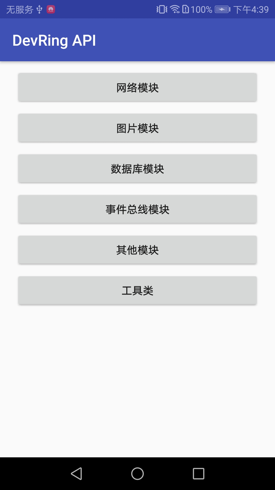

# DevRing  
[](https://github.com/LJYcoder/DevRing)
[](http://www.apache.org/licenses/LICENSE-2.0)
[](https://github.com/LJYcoder/DevRing)
[](https://www.jianshu.com/u/2ebe42698573)  

## 介绍
**DevRing**是一个提供了常用模块的**安卓基础开发库**。
<br>
主要包括 **网络请求**、**图片加载**、**数据库**、**事件总线**、**缓存**、**权限管理**、**工具类** 模块。

其中，网络请求使用Retrofit+RxJava实现，图片加载使用Glide实现（可替换），数据库使用GreenDao实现（可替换），事件总线使用EventBus实现（可替换），权限管理使用RxPermission实现。

<br>

## 使用
### [使用文档请点这里](https://www.jianshu.com/p/abede6623c58)
### 1.添加依赖
在项目module下的gradle中添加以下依赖：
```
implementation 'com.ljy.ring:devring:1.1.8'
```

### 2.初始化、配置、构建
在Application的onCreate中进行初始化、配置、构建。
<br>
务必按顺序执行这三步。

``` java

//1.初始化
DevRing.init(this);


//2.根据你的需求进行相关模块的全局配置

//配置网络请求模块，如BaseUrl,连接超时时长，Log，全局Header，Cookie，缓存，失败重试等
DevRing.configureHttp().setXXX()...

//配置图片加载模块，如替换实现框架，加载中图片，加载失败图片，开启过渡效果，缓存等
DevRing.configureImage().setXXX()...

//配置事件总线模块，如替换实现框架，EventBus的index加速
DevRing.configureBus().setXXX()...

//配置数据库模块、替换实现框架
DevRing.configureDB(dbManager);  

//配置缓存模块，如磁盘缓存的地址、大小等
DevRing.configureCache().setXXX()...

//配置其他模块，如Toast样式，是否显示RingLog，是否启用崩溃日志等
DevRing.configureOther().setXXX()...


//3.构建
DevRing.create();

```
### 3.开始调用
通过DevRing.xxxManager()得到相关模块的管理者，然后进行具体操作。
``` java
//网络请求模块：
//普通请求、上传请求、下载请求、监听上传下载进度、生命周期控制等。
DevRing.httpManager().xxx();

//图片加载模块:
//各类型图片的加载，可设置加载选项（圆形、圆角、模糊、灰白），下载图片，获取Bitmap等
DevRing.imageManager().xxx();

//事件总线模块：
//订阅、解除订阅，发送普通事件，发送粘性事件
DevRing.busManager().xxx();

//数据库模块：
//对key值对应的数据表进行增删改查等
DevRing.tableManager(key).xxx();

//缓存模块：
//提供内存缓存，磁盘缓存，SharedPreference缓存
DevRing.cacheManager().xxxCache().xxx();

//其他模块：权限管理、Activity管理
DevRing.permissionManager().xxx();
DevRing.activityListManager().xxx();

...
```
### 4.其他
提供了ActivityLifeCallback 和 FragmentLifeCallback，以实现**基类**的功能。
<br>
只需Activity实现IBaseActivity接口即可完成相关的基类操作。
<br>
只需Fragment实现IBaseFragment接口即可完成相关的基类操作。
<br>
具体请查看项目代码以及[关于基类的那些事](https://www.jianshu.com/p/3d9ee98a9570)
<br>
<br>
提供了部分常用的**工具类**：
<br>
BarUtil(状态栏导航栏颜色控制)，FileUtil（文件操作工具类），RingLog（可定位的Log打印），RingToast（吐司工具类），ImageUtil（图片工具类），NetworkUtil（网络状态工具类）、FontTypeUtil（修改App字体样式工具类）、KeyboardUtil（软键盘工具类）等。

### 5.注意事项
1. 配置参数为File时，请自行确保对传入的File具有可读写权限。  
2. 部分框架需忽略混淆，具体的混淆配置请参考Demo中app下的proguard-rules.pro文件。
3. DevRing库中AndroidManifest已添加了网络权限，所以主项目不必重复添加。
4. DevRing库中已添加了Glide，EventBus，GreenDao，Dagger2，Retrofit2，RxJava2，RxAndroid2，RxLifeCycle2，RxPermission2的依赖，所以主项目不必重复添加。
5. 可以通过exclude移除DevRing库中相关框架的依赖以减小包体积。 例如： 
``` java
api ('com.ljy.ring:devring:x.x.x'){
   //如果不需使用图片加载模块或者该模块不使用Glide实现，那么可以加上这句移除Devring库中对Glide的依赖以减小包体积
   exclude module: 'glide'
   //如果不需使用事件总线模块或者该模块不使用EventBus实现，那么可以加上这句移除Devring库中对EventBus的依赖以减小包体积
   exclude module: 'eventbus'
   //如果不需使用数据库模块或者该模块不使用GreenDao实现，那么可以加上这句移除Devring库中对GreenDao的依赖以减小包体积
   exclude module: 'greendao'
}
```

<br>

## Demo
### 内容
1. 演示了DevRing各模块的使用。
2. 演示了如何使用Fresco替换图片加载模块中默认的Glide。
3. 演示了如何使用RxBus替换事件总线模块中默认的EventBus。
4. 演示了如何使用原生数据库替换数据库模块中默认的GreenDao。  
5. 演示了如何使用LifeCycleCallback来实现Activity/Fragment基类的功能。  
....

### 运行图

<br>

## 版本信息
 - v1.1.9   (2020/7/14)
   - 兼容AndroidX
   - 迁移依赖库到AndroidX
   - 升级Glide图片加载控件到最新版本(4.9.0)
    
 - v1.1.8  （2019/5/16）
   - 修复GreenDao数据库在部分高版本系统手机上崩溃的问题。[问题和解决](https://github.com/greenrobot/greenDAO/issues/428)

 - v1.1.7  （2019/4/27）
   - 小优化

 - v1.1.6  （2019/2/21）
   - 新增根据Tag手动取消网络请求的功能

 - v1.1.5  （2019/1/29）
   - (PR by Xieyos) 网络模块新增Cookie功能，支持持久化和非持久化
   - 优化部分工具类

 - v1.1.4  （2018/12/22）
   - 修复网络模块刷新时重复添加拦截器的问题

 - v1.1.3  （2018/12/17）
   - 图片加载模块添加是否使用缓存的设置
   - 关于状态栏导航栏颜色控制：移除ColorBar，引入了Ultimatebar

 - v1.1.2  （2018/10/28）
   - 修复网络请求模块中生命周期控制无效的问题


更多版本信息点[这里](https://github.com/LJYcoder/DevRing/blob/master/VERSION.md)查看

<br>

## 相关博客
建议先熟悉相关框架的用法介绍，可更好地了解本库的用法与代码

[DevRing使用说明](https://www.jianshu.com/p/abede6623c58)
<br>
[系列开篇](http://www.jianshu.com/p/b714630bdf75)
<br>
[Retrofit+RxJava](http://www.jianshu.com/p/092452f287db)
<br>
[Fresco](http://www.jianshu.com/p/5b5625612f56)
<br>
[Glide](https://www.jianshu.com/p/2942a57401eb)
<br>
[EventBus](http://www.jianshu.com/p/6fb4d78db19b)
<br>
[ButterKnife](http://www.jianshu.com/p/5f89e3bd7fca)
<br>
[GreenDAO](http://www.jianshu.com/p/11bdd9d761e6)
<br>
[关于基类的那些事](http://www.jianshu.com/p/3d9ee98a9570) 
<br>
[常用的一些工具类](http://www.jianshu.com/p/d1361c3ea743) 
<br>

---
最后，**感谢**本项目中所涉及的开源代码的作者们。
<br>
有什么问题或建议，可以提issue或者简书告知。
<br>
如果觉得对你有帮助，不妨点个**★star**支持鼓励我~~
